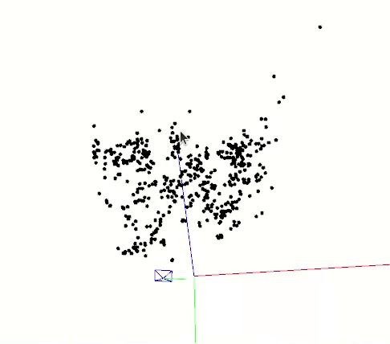

# Visual Slam

This visual SLAM implementation follows the ORB-SLAM paper (Mur-Artal et al., 2015), and implements map initialization (Map::initializeMap()), tracking (Map::localTracking()) and new point mapping (Map::localMapping()) using OpenCV algorithms. Bundleadjustement is also implemented to optimize the estimated map points and poses (Map::BundleAdjustement()) using g2o.

# How to compile:

Requirements: 
- OpenCV https://opencv.org
- Eigen3 http://eigen.tuxfamily.org
    - In linux: sudo apt install libeigen3-dev
- g2o https://github.com/RainerKuemmerle/g2o
- Easy3D https://github.com/LiangliangNan/Easy3D
- cmake (compiled with VERSION 3.11.0)
- C++14 compiler

Libraries (apart from Eigen3) can be installed from the links or just by building them from the /libs folder. We recommend that in addition to make, one also puts sudo make install, as this installs them to /.../local/include folder where our program looks for them.

After installing the requirements, we recommend a so-called out of source build which can be achieved by the following command sequence:
- cd path-to-cmakelist
- mkdir build
- cd build
- cmake ../
- make

This creates a run file named “run_slam”, which you can run using ./run_slam while in the build directory.

# TODOs
- Add filtering for bad poses and points
